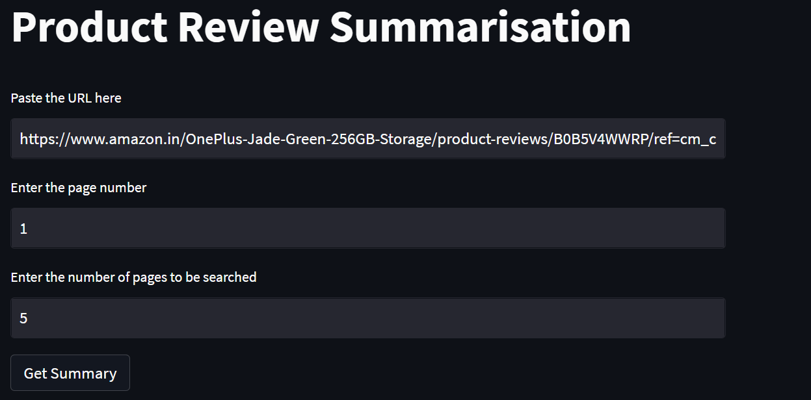
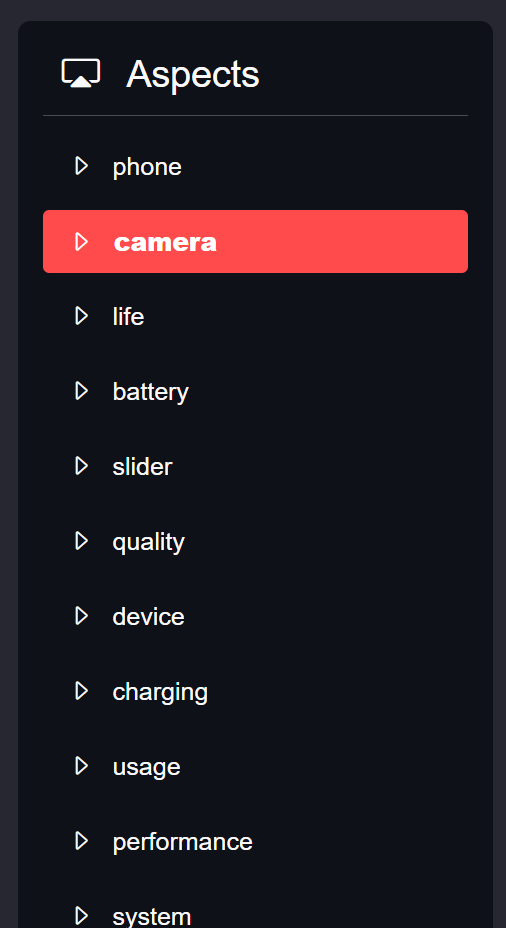
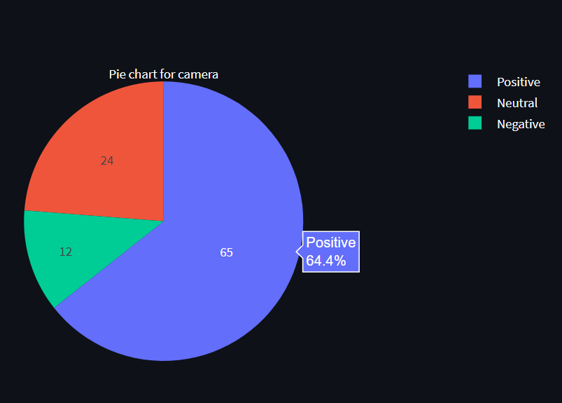
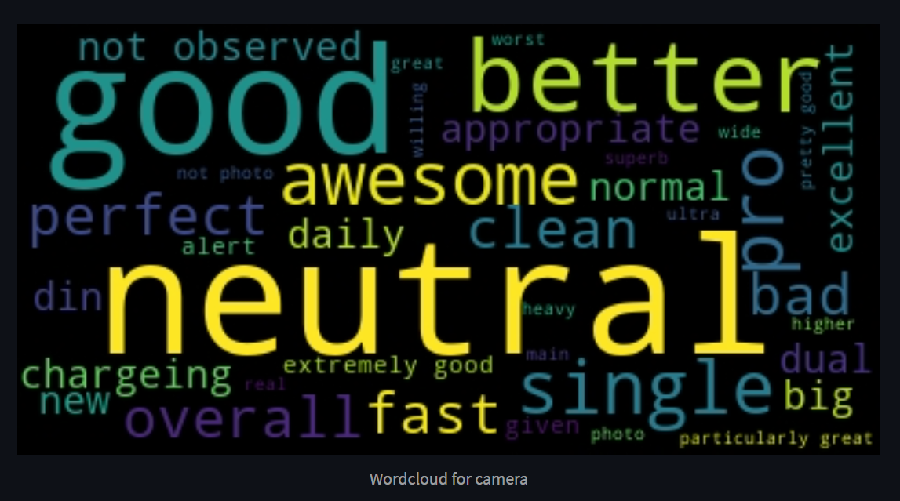

# Summarization-of-Reviews

The ML model takes in a single URL from E-commerce website as an input
and the number of pages you want to get reviews from and makes an interactive
dashboard by extracting aspects and predicting sentiments for the reviews.

This model can save a lot of customers time by summarizing the whole bunch of
reviews and displaying them in form of plots so that the customer can make
better purchase decision.

## Libraries Used:
- `BeautifulSoup`
- `requests`
- `pandas`
- `time`

## How to Run:
1. Clone this repository.
2. Install the required libraries: `pip install -r requirements.txt`.
3. Modify the `product_url` with the URL of the product's review page.
4. Run the script.
5. Follow Demo.
## Demo

**Paste the URL of product in the below model and enter the starting page number (i:e 1) and also 
the number of pages you want to surf through the reviews and hit "Get Summary".**

**On the left side, you can see all the aspects extracted from the reviews and further
you can click on any aspect to see the plots which give more insights about the aspect.**

**By clicking on any aspect and the kind of review (positive or negative) that you want to read,
the model displays the following table. Below you can see negative reviews for "camera".**

**If you scroll down below, the following plots can be seen which talk about
sentiments and the frequent words used while describing an aspect.**

## Bar Plot:

## Line Chart:

## Pie Chart:

## Wordcloud:

